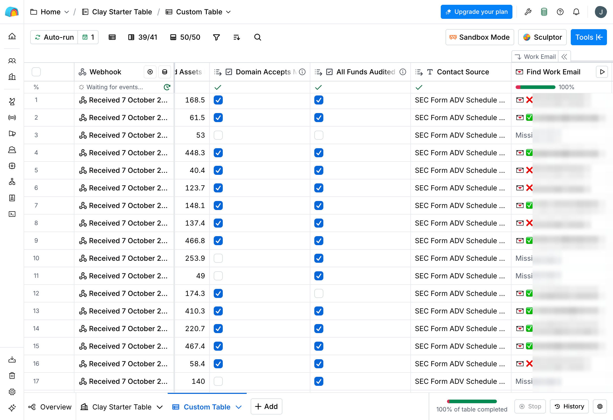
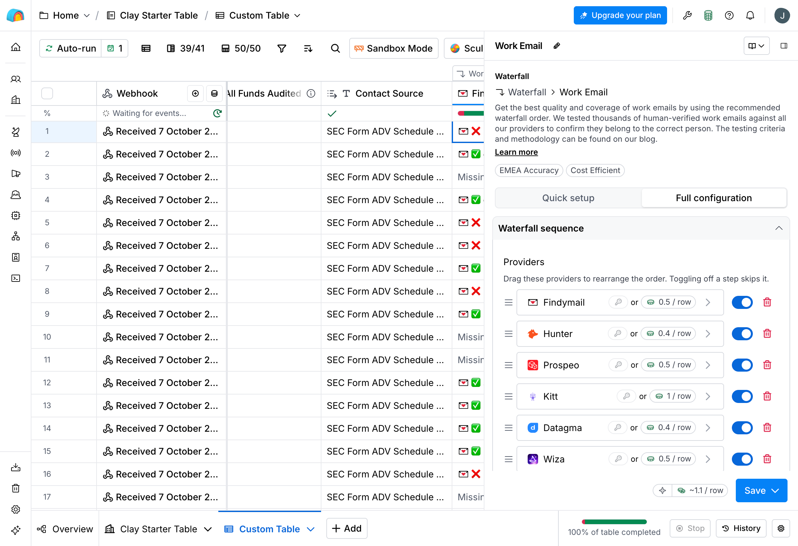

[← GTM Portfolio](../README.md)

# Fund Signal Engine

Say you sell accounting services to small investment funds. Which funds should you contact first? This project works that out from free SEC data, then checks whether its picks were right.

## Background

Every investment fund has to do its accounting each quarter: value what it owns, work out each investor's share, and send out statements. Most funds pay an outside firm to do this, called a **fund administrator**. Some smaller private equity (PE) and real estate (RE) funds still do it themselves.

Those funds are the natural customers for anyone selling fund accounting software or services. The hard part is finding them. A bought contact list tells you a fund exists. It doesn't tell you whether the fund does its own books.

The SEC knows, though. Investment advisers file a form called Form ADV that lists every private fund they manage and says whether each one uses an outside administrator. It's public, but it's 2 million rows of fund records and nobody goes through it.

## What it does

1. **Finds funds that do their own books.** It scans 2 million fund records from SEC filings for funds that report no outside administrator. Then it narrows to small, active US managers ($20M–$500M across 1–5 funds) where every PE/RE fund does its own books. That leaves 280 firms, called Tier A below.
2. **Scores which ones are likely to pay.** A model built on 20 facts from the same filings estimates how likely each firm is to start using an administrator. It's best at ruling firms out.
3. **Checks the score against what actually happened.** First against history: the model learned from 2014–17 funds and was graded on 2018–21 funds it had never seen. Then against the real future: the model only saw data up to the end of 2024, so I checked which firms went on to hire an administrator in 2025–26. Firms that passed the filter did so at twice the rate of firms that failed it (20% vs 9%). A gap that big would happen by chance only about 1 time in 90 (p = 0.011).
4. **Finds who to email.** It takes each firm's finance contact (CFO, controller) from its SEC filing, then uses Clay to find a verified work email. 41 of 50 firms got one, for 54 Clay credits.

## Why it matters

- **It targets the problem itself.** "This fund does its own books" is a public fact. So you're contacting firms that have the problem, instead of firms that just fit a size range.
- **The targeting was tested.** Most lead scoring never gets checked against what happened. This was checked twice. The first version failed, and it's still published as it was.
- **It's cheap.** The SEC data is free. Clay is only used at the last step, finding emails, at about 1.3 credits per usable address.
- **It found a real risk for the business.** Most firms that do their own books look like the firms that historically never outsourced it. Anyone selling into this market should know that before sending a single email.

Start here: [results summary](outputs/findings.md) · [scoring model](outputs/score_v2.md) · [forward test](outputs/refresh.md) · [email enrichment](outputs/enrichment.md)

<sub>Nothing here sends email. The project stops at a checked contact list.</sub>

## The data

Most outbound lists start from a bought database. This one starts from SEC filings:

- **Form ADV, Schedule D, section 7.B.(1).** Every adviser that files with the SEC lists each private fund it manages, with the fund type, its size, whether it's audited, and whether it uses an outside administrator. A "no" to that last question means the fund does its own books.
- **The SEC's monthly list of advisers** shows which firms are still active today, plus their current size and website.
- **Form D** is filed when a fund raises money. It's not much use for targeting: most fund filings leave the amount raised open-ended, and few match cleanly to a Form ADV fund. So it's only used as a sign that something new happened at a firm.

## Testing the targeting without sales data

Normally you'd check a lead score against deals you won. There aren't any here, because nothing has been sent. The filings give a substitute. If a fund reported no administrator one year and reports one a few years later, it bought fund administration. The data goes back to 2011 and each fund keeps the same ID across years. So you can ask: did the funds that scored high in a given year go on to hire an administrator within three years?

### Version 1: the score I guessed

Before looking at any results, I wrote down a simple score (one point per signal) and fixed it in [`sql/03_backtest.sql`](src/fund_signal_engine/sql/03_backtest.sql):

| Signal | Why I expected it to matter |
|---|---|
| The fund is audited | Auditors push for clean, on-time books |
| The adviser manages $20M–$500M in private funds | Big enough to need help, too small to hire a team for it |
| The adviser has 1–5 funds | No dedicated back office |
| Fund assets grew 25%+ in a year | More accounting work each quarter |

What happened (full numbers in [`outputs/findings.md`](outputs/findings.md)):

- **Doing your own books is most common where I expected.** 54% of real estate funds and 39% of PE funds report no outside administrator, against 12% of hedge funds.
- **The target list is small: 280 Tier A firms.** They're US-based, still active, manage $20M–$500M across 1–5 funds, and do the books for every PE/RE fund themselves. In 197 of them, all those funds are audited. That's few enough to write to each firm personally.
- **Only one of the four signals worked.** Audited funds hired an administrator 1.8x as often as unaudited ones. Mid-size advisers and fast-growing funds did it *less* often than the rest. The combined score was barely better than random: top scorers bought only 1.2x as often as low scorers, and a higher score didn't consistently mean more buying. I left the score unchanged, because tweaking it after seeing the results would make the test meaningless.

### Version 2: a score learned from the data

Full numbers in [`outputs/score_v2.md`](outputs/score_v2.md).

Since v1 failed, v2 lets a model (logistic regression) work out which signals matter, using 20 facts about each fund from the filings. To keep it honest, it learns only from 2014–17 funds and is graded on 2018–21 funds it never saw. v1 is graded on the same funds.

- **v2 is better, but only modestly.** Its AUC is 0.597 against v1's 0.528. AUC measures how well a score ranks buyers above non-buyers: 0.5 is a coin flip, 1.0 is perfect.
- **It's good at ruling firms out, not at picking the best ones.** The lowest-scoring 40% of funds hired an administrator 7.6% of the time. The rest did 16.0% of the time (2.1x). Within that top 60%, a higher score barely made a difference.
- **What predicts hiring an administrator.** More likely: the fund only takes large institutional or very wealthy investors ("qualified purchasers"), the manager already uses an administrator for another fund, or the fund invests in other funds. Less likely: older funds and real estate funds. The number of investors, which I expected to matter most, barely did.
- **Only 79 of Tier A's firms pass the filter** (277 could be scored, out of 280). Most firms that do their own books look like the firms that historically never paid someone else to do it. That's the biggest takeaway for the business, and a question to raise on sales calls rather than assume away.

### Forward test: what happened after 2024

Full numbers in [`outputs/refresh.md`](outputs/refresh.md).

The SEC's bulk data stops at December 2024. To bring the list up to date, I downloaded each Tier A firm's latest Form ADV (some filed as recently as September 2026) and read its fund section. The model never saw anything after 2024, so this is also a real test of its predictions.

- **The filter held up.** 16 of the 79 firms that passed it hired an administrator after 2024 (20%), against 18 of the 198 that failed (9%). If the filter were useless, a gap this big would show up by chance only about 1 time in 90 (one-sided Fisher's exact test, p = 0.011). That's close to the 2x seen in the historical test. These are small numbers, so it's a strong sign rather than proof.
- **34 of the 277 firms have bought since 2024.** 19 moved an existing fund to an administrator, and 15 launched a new fund that uses one. They come off the list, since they already have what you'd be selling.
- **That leaves 63 firms to contact.** They pass the filter and still do all their own books.
- **The PDF reading was checked against the filings.** For every firm, the number of funds the script found matches the total the firm itself reported.

### Finding contacts: free data first, Clay for the emails

Full numbers in [`outputs/enrichment.md`](outputs/enrichment.md). The step-by-step method is in [`docs/clay-enrichment.md`](docs/clay-enrichment.md).

The top 50 of the 63 firms were run (Clay's free trial limits a table to 50 rows).

- **Contacts and company domains cost nothing.**
  - **Contact:** Form ADV's Schedule A lists each firm's executives and their titles. The script picks a finance person first (CFO, controller, treasurer), then operations, compliance, and other executives. 49 of 50 firms got a named person.
  - **Domain:** taken from the website the firm lists in its filing, or found by research and checked against the filing. Every domain also has to be able to receive email (it needs an MX record). Four domains had working websites but no mail server, and one firm had no website I could verify. 45 of 50 ended up with a usable email domain.
  - Clay's own company-domain lookup found nothing in a 10-row test, which is why domains were found this way.
- **Clay was only used to find the emails.** Its "waterfall" tries one email provider after another until one finds a verified address. On its Conservative setting, it only returns addresses confirmed to accept mail. It returned 42 emails, and 41 passed my checks (82% of firms). That cost 54.1 credits, about 1.3 credits per usable email. One provider, Findymail, found 35 of them.
- **Clay's check isn't enough on its own.** It confirms an address accepts mail, not that it belongs to the right person. One "verified" address was a Yahoo account for the wrong person. My check compares each email with the contact's name, and allows for nicknames and initials (`wes`, `amn`) so those aren't wrongly rejected.

<p align="center">
  
  
</p>

## How it runs

```
SEC bulk ADV (2011–2024) ─┐
SEC adviser roster (today) ┼─► DuckDB ─► staging ─► targets (Tier A/B/C) ─► private target list
SEC Form D (last 4 qtrs) ─┘                     ├─► backtest + market map ─► outputs/findings.md
                                                 └─► score v2 (train 2014–17, test 2018–21) ─► outputs/score_v2.md
current per-firm Form ADV PDFs (2025–26) ─► refresh Tier A ─► forward test + shortlist ─► outputs/refresh.md
shortlist ─► contacts.py (Schedule A + verified domains + MX) ─► Clay email waterfall ─► QA ─► outputs/enrichment.md
```

- `ingest.py` pulls just the tables it needs out of the SEC's multi-GB bulk zip files, reading only those parts instead of downloading everything. It follows the SEC's rules: an identified User-Agent, a rate limit, and retries.
- `sql/` holds plain SQL: clean the raw data, build the target tiers, run the backtest.
- `build.py` runs the SQL and writes the summary stats (committed) and the firm-level target list (not committed).
- `score_v2.py` trains the v2 model on 2014–17 funds, tests it on 2018–21, compares it with v1, and scores today's targets.
- `refresh.py` downloads each Tier A firm's current Form ADV as a PDF and reads its private-fund section with PyMuPDF. The Yes/No checkboxes don't come through as text, so it reads them from the page layout instead. Then it builds the shortlist.
- `contacts.py` picks each firm's contact from Schedule A and checks that each domain can receive email. `clay.py` sends rows to Clay through a webhook, then checks the emails Clay returns.

## Run it

```bash
cd fund-signal-engine
uv sync
echo 'SEC_USER_AGENT="Your Name you@example.com"' > .env   # the SEC requires you to identify yourself
uv run fse-ingest     # ~5 min, ~2 GB on disk under data/
uv run fse-build
uv run fse-score
uv run fse-refresh    # ~10 min: one PDF per Tier A firm, cached under data/
uv run fse-clay push  # needs CLAY_WEBHOOK_URL in .env; then set up the waterfall per docs/
uv run fse-clay report --credits <used> --actions <used>
```

## Data handling

Everything comes from public SEC filings. The repo only holds summary statistics. Anything that names a firm or a person (adviser names, contacts, websites) is written to `data/private/` and never committed.

## Roadmap

1. ~~Target list + backtest~~
2. ~~Score v2, trained and tested on separate years~~
3. ~~Update Tier A from each firm's current Form ADV, plus a forward test~~
4. ~~Contacts from SEC filings + Clay email waterfall, with QA and cost per usable email~~
5. Personalized opening lines written from each fund's own filing data (drafted, not sent)
6. Daily job in n8n: new filings → remove duplicates → score → Slack alert
7. Public dashboard: a map of the fund administration market
