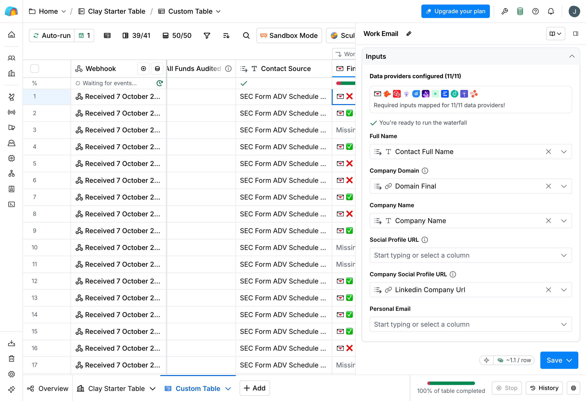

[← Fund Signal Engine](../README.md)

# Finding contacts: SEC data first, Clay for the emails

This is how the top 50 firms on the contact list got a verified work email for their finance contact. (Clay's free trial limits a table to 50 rows.)

Clay charges credits for every lookup, so the rule was: get everything the SEC filings can tell you first, and only use Clay for what they can't.

- **Company domain** (the part after the @ in an email address).
  - 32 of the 50 firms list a website in their Form ADV.
  - The other 18 list a LinkedIn page, a social profile, or nothing. I researched them and checked each result against the address and people named in the filing. 16 were confirmed. Clay's name-to-domain lookup was tried first, but found nothing in a 10-row test.
  - **Every domain also has to be able to receive email.** That means it needs an MX record, which you can check with a free DNS lookup.
    - Three domains from the filings, and one found by research, have working websites but no mail server. Email sent to them would bounce.
    - One firm has no website I could verify.
    - Some firms use a different domain for email than for their website (e.g. nrdcequity.com for the site, nrdc.com for email). In those cases the email domain is used.
  - **Result: 45 of 50 have a domain that can receive email.**
- **Contact.**
  - Taken from **Schedule A** of the firm's Form ADV, which lists its executive officers and owners with their titles. The current filing is checked first, then the 2024 bulk data.
  - The script prefers finance titles (CFO, controller, treasurer), then operations, compliance, and other executives. Whoever runs the books is the person who'd buy fund accounting help.
  - 49 of 50 firms got a named person this way, 17 of them in finance roles. No cost.
- **44 of 50 rows reach Clay with both** a domain that can receive email and a named contact.
- **Clay** is then used for two things only: matching LinkedIn profiles, and its work-email waterfall, which tries one email provider after another until one finds a verified address.

Code that picks the domain and contact: [`contacts.py`](../src/fund_signal_engine/contacts.py). Sending rows to Clay: `fse-clay push`. Checking the results: `fse-clay report`.

## 1. Create the table

1. In Clay: **New table → Import → Webhook**. If it offers **auto-extract new columns**, turn it on, so each field gets its own column.
2. Put the webhook URL in `.env` as `CLAY_WEBHOOK_URL` and run `uv run fse-clay push`. That sends the 50 rows.
3. **Check:** 50 rows, with columns including `company_name`, `domain_final`, `contact_first_name`, `contact_last_name`, `contact_full_name`, `contact_title` and `contact_source`.

## 2. Work-email waterfall → `Work Email`, `Email Provider`

As of October 2026, Clay's screens don't quite match its docs. These are the steps I actually used:

1. **Add enrichment** (top right) → search **Work Email** → **Full configuration**.
2. Map the inputs. Clay wants a full name, not first and last separately:
   - **Full name** → `contact_full_name`
   - **Company domain** → `domain_final`
   - **Company name** → `company_name`
   - **Company social profile URL** → `linkedin_company_url`
3. Infer email: **off**, so Clay doesn't guess addresses from a name pattern.
4. **Validation strategy: Conservative.** It's the only option on the trial (Balanced is greyed out). It only returns addresses confirmed to accept mail, and skips domains that accept any address (catch-all domains), since those can't be confirmed.
5. **Output name of successful provider: on.**
6. Run 10 rows first. That cost 11 credits and found 4 emails from the 8 rows that could be searched. Then run the rest from the column header.

Because the company name is one of the inputs, the waterfall can still find an email for firms with no verified domain. `fse-clay report` flags those, and checks every email against the contact's name and the firm's domain (see Checks below).

## 3. Optional: LinkedIn profile → `Contact LinkedIn`

Add a person-level LinkedIn lookup using `contact_full_name` + `company_name` + `domain_final`. Run 10 rows first. It tells you how many contacts have a LinkedIn profile and gives the email waterfall more to match on, but it costs credits, so it's optional on a trial.

## 4. Export and check

1. Export the table to CSV and save it as `data/private/clay_export.csv` (not committed).
2. Note the credits used: the balance before minus the balance after, from workspace → Settings → Plans & Billing.
3. Run `uv run fse-clay report --credits <data credits> --actions <actions>`. That writes [`outputs/enrichment.md`](../outputs/enrichment.md): how many firms made it through each step, where the contacts came from, and the cost per verified email.

## Checks

Clay's validation proves an address accepts mail, not that it belongs to the right person. So the report checks every email it returns:

- **Personal addresses are rejected.** One came back: a Yahoo address, for a firm with no domain.
- **The part before the @ has to plausibly match the contact.** It can be their name or surname, a short first name (`wes` for Wesley), or initials, including middle names or a second surname (`amn`, `ogn`).
- **Emails on a different domain from the firm's website are counted, but listed separately.** Usually that's the firm's real email domain, or an affiliated company's.

## Screenshots

**The table:** the 50 rows sent by webhook, with the waterfall run. Emails are pixelated.

**Waterfall inputs:** full name, domain, company name, company LinkedIn.

**Provider order:** Findymail, Hunter, Prospeo, Kitt, Datagma, Wiza, …

